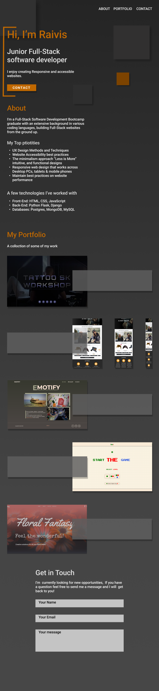

## *The live site link can be found [Here](https://raivis80.github.io/My-Portfolio/)*
### Table of contents

1. [License](#License)

## Introduction

An online representation of the work I have created provides a convenient way for potential clients to view my skills and services.


The website is build using primarily with React library combined with HTML5, CSS3, JavaScript.

## UI
### **Functionality Requirements**
- Website Navigation
   - Links for website template sections.
   - Responsive navigation
- Landing page
    - React library for building user interfaces.
    - Use of MUI for responsive design.
    - Use of Cool JavaScript dynamic Effects.
    - Social Media links to external resources.
- Contact form.
   - Javascript API form control or similar

### **Content Requirements**
- NavBar
   - Navigation Links
   - Site brand name
- Landing Page
   - My name
   - What i Do
   - Short description
- About
    - Lond what i do
    - My Stack
    - Top priorities 
- Portfolio
    - Image
    - Title
    - Description 
- Contact
   - Contact Form
   - Social Links
- footer
   - Copyright
   - Social Links

### **Wireframes**

- 

## Design
### **Color Scheme**
- Color scheme used through out the site [coolors.co](https://coolors.co/855433-b37142-8d6245-292a2b)

## **Technologies and Frameworks**

### **Languages Used**
-   [HTML5](https://en.wikipedia.org/wiki/HTML5) Hypertext Markup Language (HTML)
-   [CSS3](https://en.wikipedia.org/wiki/Cascading_Style_Sheets) Cascading Style Sheets (CSS)
-   [JavaScript](https://www.javascript.com/) Interactive functionality.

### **Frameworks, Libraries & Programs Used**
- [React](https://reactjs.org/) A JavaScript library for building user interfaces
- [MUI:](https://mui.com/) was used to style the website.
- [Google Fonts:](https://fonts.google.com/) were used throughout the site.
- [Git](https://git-scm.com/) Git was used for version control.
- [GitHub:](https://github.com/) used to store the projects code.

## **Deployment**
$ npm install

### **Deploying on GitHub Pages**
1. [Clone](#Creating-a-Clone) Or [fork]{#Forking-the-Repository) repository first.
1. $ npm install
1. Change settings to package.jason
   - "homepage": "http://<github_user_name>.github.io/<github_repo_name>"
   - Add to "scripts" 
      ```json
         "scripts": {
         "start": "react-scripts start",
         "predeploy": "npm run build", //add this
         "deploy": "gh-pages -d build", //add this
         "build": "react-scripts build",
         "test": "react-scripts test",
         "eject": "react-scripts eject"
         },
      ```
1. Now run the deploy script to deploy the project.
   - npm run deploy
1. Done


### License

Distributed under the MIT License. See [LICENSE](LICENSE) for more information.
